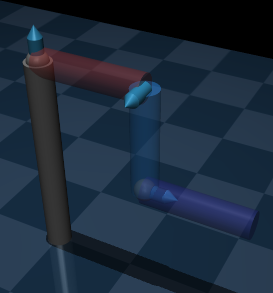
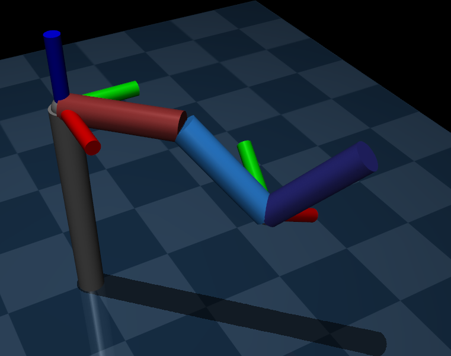
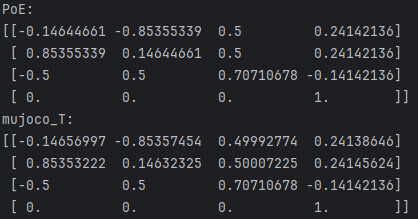
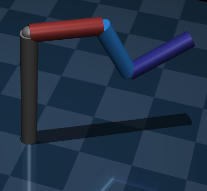
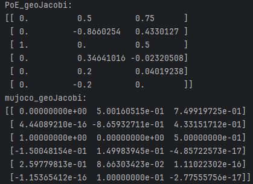

### 1
The model in mujoco with joint z axis:

The xml file:
```
<mujoco model="3R_robot">
    <compiler angle="degree"/>
    <asset>
        <texture name="grid" type="2d" builtin="checker" rgb1=".1 .2 .3"
        rgb2=".2 .3 .4" width="300" height="300" mark="none"/>
        <material name="grid" texture="grid" texrepeat="6 6" texuniform="true" reflectance=".2"/>
    </asset>
    <default>
        <joint type="hinge" axis="0 0 1" limited="true"/>
        <geom type="cylinder" size=".025 .1" />
    </default>

    <option gravity="0 0 0"/>

    <worldbody>
        <light diffuse=".5 .5 .5" pos="0 0 3" dir="0 0 -1"/>
        <geom type="plane" size="1 1 0.1" material="grid"/>

        <site name="begin_effector" pos="0 0 0.4" size="0.02"/>
        <!-- Base of the Robot -->
        <body name="BaseLink" pos="0 0 0.2" euler="0 0 -90">
            <geom type="cylinder" pos="0 0 0" size=".025 .2"/>

            <!-- Link 1 and Joint 1 -->
            <body name="link1" pos="0 0.1 0.2" euler="-90 0 0">
                <joint name="joint1" pos="0 0 -0.1" range="-inf inf" axis="0 -1 0" damping="1"/>
                <geom pos="0 0 0" rgba=".6 .2 .2 1"/>

                <!-- Link 2 and Joint 2 -->
                <body name="link2" pos="0 0.1 0.1" euler="-90 0 0">
                    <joint name="joint2" pos="0 0 -0.1" range="-inf inf" axis="1 0 0" damping="1"/>
                    <geom pos="0 0 0" rgba=".2 .6 1 1"/>

                    <!-- Link 3 and Joint 3 (New) -->
                    <body name="link3" pos="0 -0.1 0.1" euler="90 0 90">
                        <joint name="joint3" pos="0 0 -0.1" range="-inf inf" axis="0 0 1" damping="1"/>
                        <geom pos="0 0 0" rgba=".2 .2 .6 1"/>
                        <!-- End Effector -->
                        <site name="end_effector" pos="0 0 -0.1" size="0.02"/>
                    </body>
                </body>
            </body>
        </body>
    </worldbody>

    <!-- Actuators for controlling the joints -->
    <actuator>
        <!-- Motor control for joint1 (torque control) -->
        <!--
        <motor name="joint1_motor" joint="joint1" ctrlrange="-10 10" gear="1"/>
        <motor name="joint2_motor" joint="joint2" ctrlrange="-10 10" gear="1"/>
        <motor name="joint3_motor" joint="joint3" ctrlrange="-10 10" gear="1"/>
        -->
        <position name="joint1_position_control" joint="joint1" kp="10" kv="0.02" ctrlrange="-3.14 3.14"/>
        <position name="joint2_position_control" joint="joint2" kp="10" kv="0.02" ctrlrange="-3.14 3.14"/>
        <position name="joint3_position_control" joint="joint3" kp="10" kv="0.02" ctrlrange="-3.14 3.14"/>

    </actuator>

    <!-- Sensors for monitoring joint positions and torques -->
    <sensor>
        <jointpos name="joint1_position_sensor" joint="joint1"/> <!-- Position sensor for joint1 -->
        <jointpos name="joint2_position_sensor" joint="joint2"/> <!-- Position sensor for joint2 -->
        <jointpos name="joint3_position_sensor" joint="joint3"/> <!-- Position sensor for joint3 -->
    </sensor>
    <keyframe>
        <!-- Initial configuration for three joints -->
        <key name="initial_pose" qpos="0 0 0"/>
        <!-- Bent configuration for three joints -->
        <key name="bent_pose" qpos="0 0 0"/>
    </keyframe>

</mujoco>
```
### 2

To get the POE, we define the math tools that used for compute $T$:
```
def Adjoint(T):
    # Extract rotation matrix R and translation vector p from T
    R = T[:3, :3]
    p = T[:3, 3]
    # Create the skew-symmetric matrix of the translation vector p
    p_skew = vector_to_skew_symmetric(p)
    # Create the adjoint representation
    adj_T = np.block([
                     [R, np.zeros((3, 3))],
                     [p_skew @ R, R]
                     ])
    return adj_T
def PoE(theta, w, v, M):
    n = w.shape[0]
    T = np.eye(4)
    for i in range(n):
        T = T @ exp2T(theta[i], w[i, :], v[i, :])
    return T @ M

def exp2T(theta, w, v):
    R = Rodrigues(w, theta)
    p = G(w, theta) @ v
    top = np.hstack((R, p.reshape(-1, 1)))
    bottom = np.hstack((np.zeros((1, 3)), np.eye(1)))
    return np.vstack((top, bottom))
def Rodrigues(w_3, theta):
    w_skew = vector_to_skew_symmetric(w_3)
    return np.eye(3) + np.sin(theta) * w_skew + (1 - np.cos(theta)) * w_skew @ w_skew

def G(w_3, theta):
    w_skew = vector_to_skew_symmetric(w_3)
    return np.eye(3) * theta + (1 - np.cos(theta)) * w_skew + (theta - np.sin(theta)) * w_skew @ w_skew

def vector_to_skew_symmetric(v_3):
    return np.array([[0, -v_3[2], v_3[1]],
                     [v_3[2], 0, -v_3[0]],
                     [-v_3[1], v_3[0], 0]])

def mergeRp(R,p):
    top = np.hstack((R, p.reshape(-1, 1)))
    bottom = np.hstack((np.zeros((1, 3)), np.eye(1)))
    return np.vstack((top, bottom))

def relative_pose(T_A, T_B):
    R_B = T_B[:3, :3]
    p_B = T_B[:3, 3]

    R_B_inv = R_B.T  # R 的转置为其逆矩阵
    p_B_inv = -R_B_inv @ p_B  # 计算逆的平移部分

    # 构造 T_B 的逆矩阵
    T_B_inv = np.eye(4)
    T_B_inv[:3, :3] = R_B_inv
    T_B_inv[:3, 3] = p_B_inv

    # 计算 T_AB = T_B_inv * T_A
    T_AB = T_B_inv @ T_A

    return T_AB
```
Then make the all the robot joint rotate $45\degree$, and use the mujoco build-in function to get $^{s}T_b$:

```
def evaluateT(data):
    data.ctrl[:] = target_positions

    p0 = data.site_xpos[0]
    R0 = data.site_xmat[0].reshape(3, 3)
    mujoco_T0 = utils.mergeRp(R0, p0)

    p1 = data.site_xpos[1]
    R1 = data.site_xmat[1].reshape(3, 3)
    mujoco_T1 = utils.mergeRp(R1, p1)

    PoE_T = utils.PoE(theta, w, v, M)
    print("mujoco_T:")
    print(utils.relative_pose(mujoco_T1, mujoco_T0))
    print("PoE:")
    print(PoE_T)

theta = np.array([np.pi/4, np.pi/4, np.pi/4])
target_positions = theta

with mujoco.viewer.launch_passive(model, data) as viewer:
    while viewer.is_running():
        mujoco.mj_step(model, data)
        evaluateT(data)
        viewer.sync()
```
We get the $T$ result of Mujoco and PoE in terminal:

The result show that the PoE is right.
### 3
Firstly we need the math functions to get space jacobi:
```
def space_jacobi(theta, w, v):
    n = w.shape[0]
    J = np.zeros((6, n))
    S = np.vstack((w.T, v.T))
    for i in range(n):
        if i == 0:
            J[:, i] = S[:, i]
        else:
            J[:, i] = Adjoint(sub_exp(theta, w, v, i)) @ S[:, i]
    return J
def sub_exp(theta, w, v, k):
    T = np.eye(4)
    for i in range(k):
        T = T @ exp2T(theta[i], w[i, :], v[i, :])
    return T

def Adjoint(T):
    # Extract rotation matrix R and translation vector p from T
    R = T[:3, :3]
    p = T[:3, 3]
    # Create the skew-symmetric matrix of the translation vector p
    p_skew = vector_to_skew_symmetric(p)
    # Create the adjoint representation
    adj_T = np.block([
                     [R, np.zeros((3, 3))],
                     [p_skew @ R, R]
                     ])
    return adj_T
```
Then make the all the robot joint rotate $30\degree$, we get the jacobian of end site with mujoco build-in function:
```
def evaluateGeoJacobi(data):
    data.ctrl[:] = target_positions
    mujoco_geoJacobi(model, data)
    PoE_geoJacobi(theta, w, v)

def mujoco_geoJacobi(model, data):
    nq = model.nq  # 机器人关节的自由度数
    jacp_end = np.zeros((3, nq))  # 线速度部分的雅可比矩阵 (3 x N)
    jacr_end = np.zeros((3, nq))  # 角速度部分的雅可比矩阵 (3 x N)
    mujoco.mj_jacSite(model, data, jacp_end, jacr_end, 1)
    J_end = np.vstack((jacr_end, jacp_end))
    print("mujoco_geoJacobi:")
    print(J_end)


def PoE_geoJacobi(theta, w, v):
    J = utils.space_jacobi(theta, w, v)
    p0 = data.site_xpos[0]
    R0 = data.site_xmat[0].reshape(3, 3)
    mujoco_T0 = utils.mergeRp(R0, p0)
    print("PoE_geoJacobi:")
    print(utils.Adjoint(mujoco_T0) @ J)
theta = np.array([np.pi/6, np.pi/6, np.pi/6])
target_positions = theta

with mujoco.viewer.launch_passive(model, data) as viewer:
    while viewer.is_running():
        mujoco.mj_step(model, data)
        evaluateGeoJacobi(data)
        viewer.sync()
```


The 1-3 row $\omega$ is right, but the 4-6 row $v$ is not right, because the mujoco build-in function "mujoco.mj_jacSite" can only compute the jacobian of site.
### 4
**(a)**
By the defination of twist:
$$
^0\dot{q} = ^0v_q + ^0\omega\times^0q = -^0q\times^0\omega +  ^0v_q 
$$
$$
= \begin{bmatrix} -[^0q]|I_{3\times3}\end{bmatrix}\begin{bmatrix} ^0\omega \\ ^0v_q \end{bmatrix}
$$
$$
= \begin{bmatrix} -[^0q]|I_{3\times3}\end{bmatrix} ^{0}J(\theta) \begin{bmatrix} \dot\theta_1 \\ \dot\theta_2 \\ \dot\theta_3 \end{bmatrix}
$$
$$
^0q = ^0T_3 ^3q
$$
$$
J_a(\theta) = \begin{bmatrix} -[^0T_3 ^3q]|I_{3\times3}\end{bmatrix} ^{0}J(\theta)
$$
$$
^0T_3 = e^{[\cal{S_1}]\theta_1}e^{[\cal{S_2}]\theta_2}e^{[\cal{S_3}]\theta_3}
$$
$^{0}J(\theta)$ is geometric Jacobian.
**(b)**
```
def jacobian_a(theta, w, v, q):
    n = len(w)
    J = geometric_jacobian(theta, w, v)  # Get the geometric Jacobian
    
    # Compute the transformation from frame 0 to frame 3 (0 to 3)
    T_03 = np.eye(4)
    for i in range(n):
        T_03 = T_03 @ exp2T(theta[i], w[i], v[i])  # Multiply exponentials for each joint

    # Skew-symmetric matrix of q (the local coordinate of point g in frame 3)
    q_skew = vector_to_skew_symmetric(q)
    
    # Jacobian in frame 0 using the formula
    adj_T_03 = Adjoint(T_03)  # Adjoint transformation matrix
    J_a = np.vstack([adj_T_03[:3, :3] @ J[:3, :], np.zeros((3, n))])  # Linear part
    J_a[:3, :] += adj_T_03[3:, :3] @ q_skew @ J[3:, :]
    
    return J_a

theta = np.array([np.pi/4, np.pi/4, np.pi/4])
w = np.array([[0, 0, 1],
              [0, -1, 0],
              [1, 0, 0]])

v = np.array([[0, 0, 0],
              [0, 0, -l1],
              [0, -l2, 0]])
q = np.array([1, 2, 3])  # Point q in frame 3

# Compute the Jacobian at θ = (π/4, π/4, π/4)
J_a = jacobian_a(theta, w, v, q)
print("Jacobian J_a(theta):\n", J_a)
```